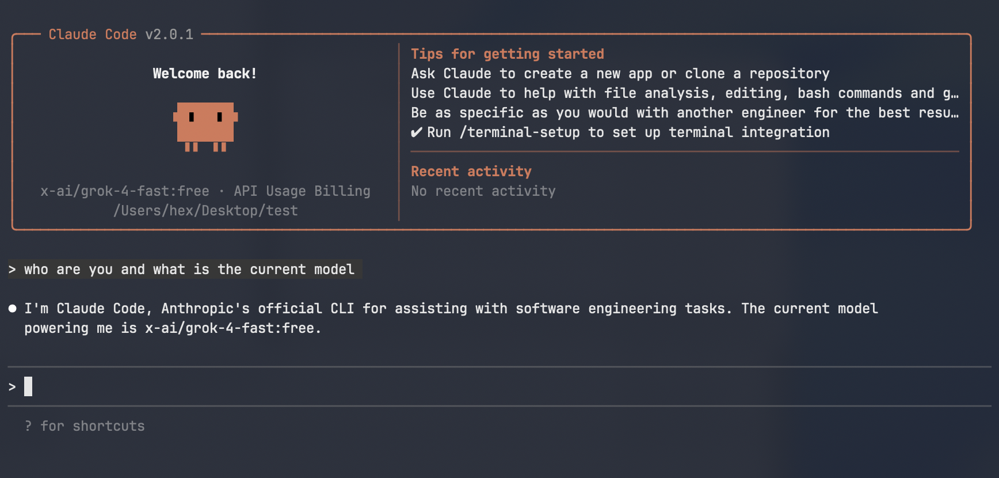

# ClaudeCode2OpenAIProxy

This guide explains how to use **Cloudflare Workers** to implement a proxy that forwards Anthropic Claude Code requests to OpenAI-compatible APIs from various large language model (LLM) providers. The proxy converts Claude-formatted requests (e.g., for the `/v1/messages` endpoint) into OpenAI-compatible format (e.g., `/v1/chat/completions`) and handles authentication, streaming, and tool calls.



## Deployment

1. **Prepare the Code**:
   - Copy the source code from `worker.js` (provided in the repository or previous context).

2. **Create a Worker**:
   - Log in to the [Cloudflare Dashboard](https://dash.cloudflare.com/).
   - Navigate to **Workers & Pages** > **Overview** > **Create application** > **Create Worker**.
   - Select the **Hello World** template to generate a basic project.

3. **Deploy the Code**:
   - In the Worker editor, replace the default content of `worker.js` with the copied source code.
   - Save and deploy the Worker. Your Worker will be available at a URL like `https://your-worker-name.your-subdomain.workers.dev`.

4. **Configure the Proxy Endpoint**:
   - In `worker.js`, change `API_ENDPOINT` to the OpenAI-compatible API URL (e.g., `https://api.openai.com/v1/chat/completions`).

## Usage

To integrate the proxy with tools like Claude Code (or similar clients expecting Claude's API), configure your environment variables to point to the Worker as the Anthropic endpoint. The setup varies slightly by operating system (e.g., Linux/macOS with Bash/Zsh, Windows with PowerShell). Search for "export environment variables [your OS/shell]" if needed.

### Required Environment Variables

Set these three variables in your shell or IDE configuration:

#### For Claude Code Integration
```bash
export ANTHROPIC_BASE_URL="https://your-worker-name.your-subdomain.workers.dev"
export ANTHROPIC_AUTH_TOKEN="sk-or-v1-apikey"
export ANTHROPIC_MODEL="x-ai/grok-4-fast:free"
```

- `ANTHROPIC_BASE_URL`: Points to your deployed Worker (replaces Claude's official base URL).
- `ANTHROPIC_AUTH_TOKEN`: Your API key for the upstream LLM provider (passed via `Authorization: Bearer <token>`).
- `ANTHROPIC_MODEL`: The model identifier (e.g., for Grok, OpenAI's GPT, DeepSeek ... ).

#### API Endpoint Reference
When configuring `API_ENDPOINT` in your Worker, choose from these OpenAI-compatible providers:

| Provider     | Endpoint URL                                      |
|--------------|---------------------------------------------------|
| **OpenAI**  | `https://api.openai.com/v1/chat/completions`     |
| **OpenRouter** | `https://openrouter.ai/api/v1/chat/completions` |
| **Baidu Qianfan** | `https://qianfan.baidubce.com/v2/chat/completions` |
